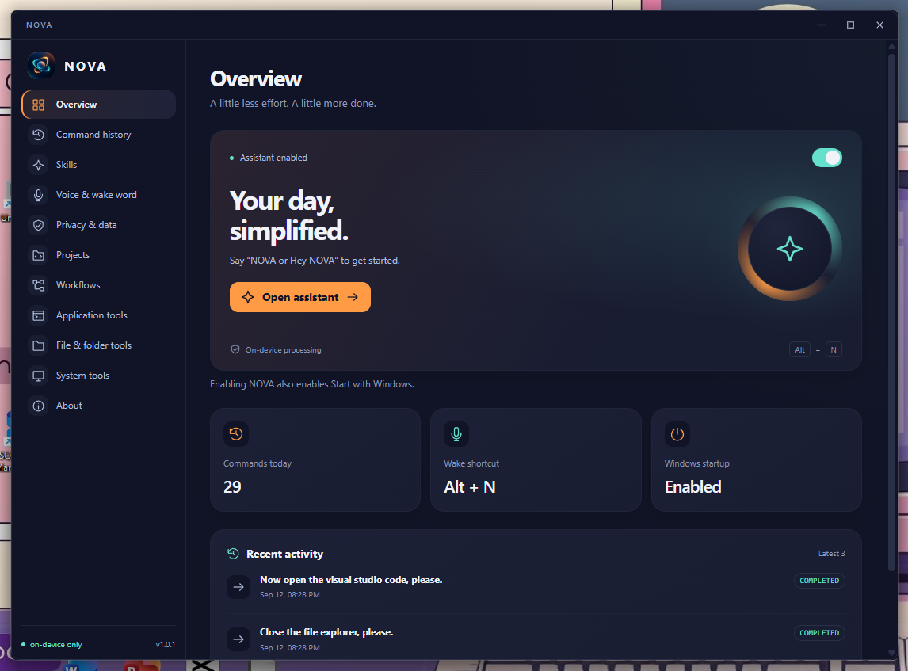
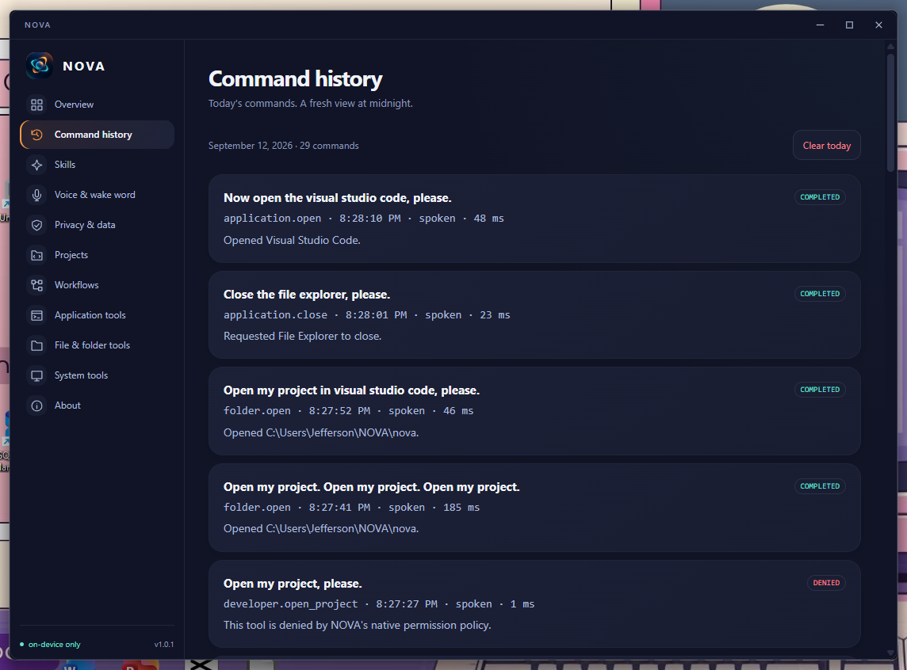
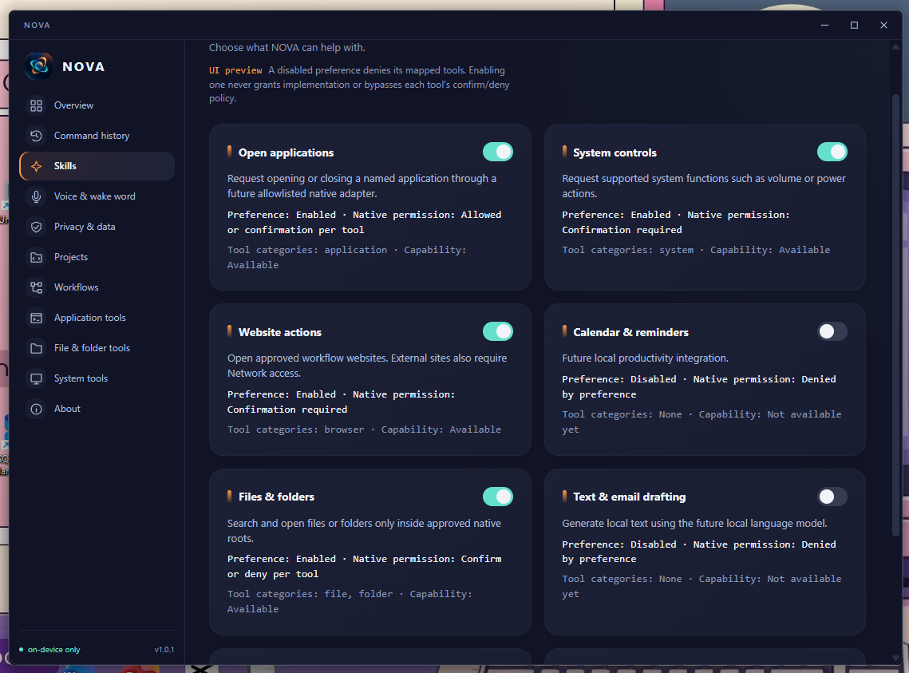
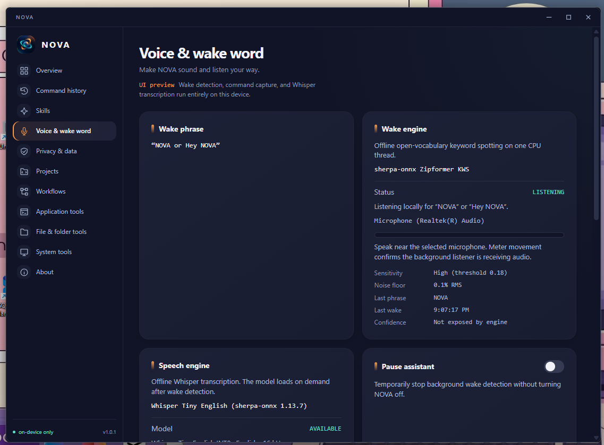
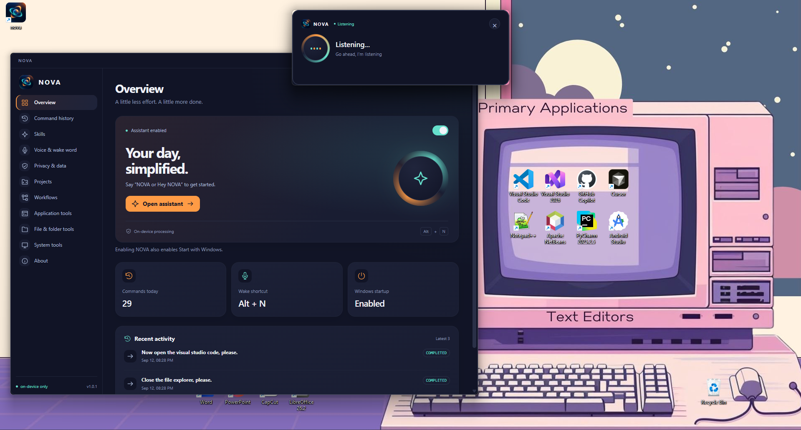

<p align="center">
        
</p>

# NOVA 1.0.1 - local Windows development assistant

NOVA is a compact desktop assistant with a dark navy interface, orange actions, mint status indicators and monospace technical details. It combines local wake-word detection, speech recognition, optional voice replies, and permission-checked desktop tools. Development projects and reusable workflows are configured by the user, not generated and executed by an AI model.

This is a **local Windows development release**, not a signed public distribution. See [the Phase 16 engineering report](docs/PHASE16_ENGINEERING_REPORT.md) for measured validation and remaining manual checks.

## Current installed release

[Version 1.0.1 release notes](docs/RELEASE_1.0.1.md) describe the floating assistant and dashboard layout fixes. Each installed release has a new version: patch increments for fixes (1.0.1), minor increments for new features (1.1.0). Package, Cargo, and Tauri versions must match before packaging.

## Features

- Floating assistant, Alt+N wake shortcut, Hey NOVA/NOVA keyword detection, tray controls, and a persistent global OFF switch tied to Windows autostart.
- Local Whisper transcription through sherpa-onnx; optional Windows SAPI voice replies with wake interruption and text fallback.
- Deterministic natural-language routing for common commands, with an optional local Ollama `qwen3:1.7b` classifier.
- Native application, approved file/folder, system-volume, system-information and window tools.
- Persistent project profiles: ID, name, path, editor, frontend command, backend command, working directory, development URL, notes and explicit voice permission.
- `developer.open_project`, `developer.start_project`, `developer.stop_project`, `developer.open_editor`, `developer.open_dev_url` and `workflow.run`.
- Workflows with editable names, ordered steps, enable/disable, voice permission, and confirmed deletion. Each step uses a typed native NOVA tool; recursion and arbitrary scripts are rejected.
- Local history with timestamp, input source, input, interpreted action, result, status and duration. Logging can be disabled.
- Real privacy controls, confirmed clearing of NOVA data, detected runtime metadata, and single-instance protection.

## Privacy philosophy

Core wake detection, transcription, speech synthesis, intent classification and native tools require no cloud AI service. Microphone audio is processed in memory and not saved by NOVA. History and configurations are stored in the application's local data directory.

The Network access setting controls NOVA opening external HTTP(S) websites. Loopback Ollama and development URLs stay available. **It is not a firewall**: editors, browsers, npm scripts, .NET applications and other launched programs have their own permissions and network behavior.

Clear local data removes NOVA settings, history, project profiles and workflows, clears transient conversation/search context, stops managed project processes, and turns NOVA/autostart off. It keeps actual project files and bundled model assets. You must type `CLEAR NOVA DATA` to proceed.

Initial provisioning of Node, Rust, WebView2, Ollama and model files may require downloads. Once installed, core inference does not depend on a cloud endpoint.

## Architecture and technology

```text
React 19 / TypeScript / Vite
  Dashboard + assistant webview
          |
  Tauri 2 scoped IPC capabilities
          |
  Native Rust schema validation + skill permissions
          |
  Application / file / system / window adapters
  Saved project runner / saved workflow runner
          |
  Windows APIs + owned Job Objects

Microphone -> CPAL conditioning -> sherpa-onnx wake detector
           -> VAD + Whisper -> deterministic parser / local Ollama
           -> native tool router -> text + optional Windows SAPI
```

The frontend cannot run a shell or access the filesystem through a broad plugin. The assistant webview receives voice/state events and has only hide/resize permissions. Configuration, data clearing and execution controls belong to the dashboard.

- Rust, Tauri 2, React 19, TypeScript 6, Vite 8.
- CPAL, sherpa-onnx, ONNX models for keyword spotting, VAD and Whisper.
- Windows SAPI desktop voices, COM, registry discovery and Windows Job Objects.
- `tauri-plugin-store`, autostart and global-shortcut plugins.
- Optional loopback-only Ollama API with `qwen3:1.7b`.

## Requirements

NOVA is currently a **Windows-only desktop application**. Install the required tools before cloning or building:

### Required for development

- Windows 10 or 11, x64.
- [Git for Windows](https://git-scm.com/download/win).
- [Node.js 22 LTS](https://nodejs.org/en/download) with npm. The development environment used for this release is Node 22.15.0; use `node --version` and `npm --version` to verify it.
- [Rust with rustup](https://rustup.rs/), using the stable `x86_64-pc-windows-msvc` toolchain. The Tauri build requires the MSVC target, not the GNU target.
- [Microsoft C++ Build Tools](https://visualstudio.microsoft.com/visual-cpp-build-tools/) with **Desktop development with C++**, MSVC x64/x86 build tools, and a Windows 10/11 SDK selected.
- [Microsoft Edge WebView2 Runtime](https://developer.microsoft.com/en-us/microsoft-edge/webview2/) Evergreen Runtime. The installer can bootstrap WebView2 on a connected machine, but installing it first avoids first-run failures.
- A working internet connection for the first `npm ci` and Cargo dependency download. Normal local inference does not require a cloud AI account.

### Required for voice features

- An available microphone. Windows microphone privacy permission must allow NOVA/Desktop apps to use it.
- An output device for audio replies.
- Microsoft **David** or **Zira** desktop SAPI voice. Without one, text commands still work and NOVA displays text replies instead of speaking them.
- No separate speech-model download is needed for the normal checkout. Wake-word, VAD, and Whisper Tiny English INT8 files are bundled under `src-tauri/resources` and packaged by Tauri.

### Optional features

- [Ollama for Windows](https://ollama.com/download/windows) and the `qwen3:1.7b` model enable local natural-language classification for commands that are not handled by NOVA's deterministic parser. Ollama is not required for the dashboard or common deterministic commands.
- [Visual Studio Code](https://code.visualstudio.com/Download), [Cursor](https://www.cursor.com/downloads), [Visual Studio](https://visualstudio.microsoft.com/downloads/), or [Android Studio](https://developer.android.com/studio) for opening saved projects. NOVA only recognizes these supported editors.
- [.NET SDK](https://dotnet.microsoft.com/download/dotnet) is needed only for saved projects that use `dotnet run`.

If a prerequisite or optional tool is already installed on your device, skip its installer link and continue with the version check or setup step. Do not reinstall it unless the required version or component is missing.

Check the core toolchain from a new PowerShell window after installation:

```powershell
git --version
node --version
npm --version
rustc --version
cargo --version
rustup show active-toolchain
```

## Clone and run from source

1.  Open PowerShell and clone the repository:

        ```powershell
        git clone <repository-url> nova
        cd nova
        ```

        Replace `<repository-url>` with the repository's HTTPS or SSH URL.

2.  Confirm that the bundled resources exist. These directories should be present in a normal clone:

        ```text
        src-tauri/resources/wake-word
        src-tauri/resources/speech/sherpa-onnx-whisper-tiny.en
        src-tauri/resources/vad
        ```

        Do not delete or selectively omit these directories; the desktop voice engine depends on them.

3.  Install the exact locked frontend dependencies:

        ```powershell
        npm ci
        ```

4.  Start NOVA as a Tauri desktop application:

        ```powershell
        npm run tauri dev
        ```

        The first Rust build can take several minutes while Cargo downloads and compiles native dependencies. Keep the terminal open while using the development app.

For UI-only work, use `npm run dev`. This opens a browser preview, but browser mode cannot exercise native IPC, microphone capture, wake detection, Windows tools, tray behavior, or project process control.

## Install and configure Ollama

Ollama is optional. Install it only if you want model-assisted natural-language routing.

1.  If Ollama is not installed, install [Ollama for Windows](https://ollama.com/download/windows). If it is already installed, skip the installer and continue.
2.  Start Ollama from the Start menu, or launch `ollama serve` in PowerShell if the service is not already running.
3.  Open a new PowerShell window and download the exact model NOVA expects:

        ```powershell
        ollama pull qwen3:1.7b
        ```

        This downloads approximately 1.4 GB and needs approximately 2.5-3.5 GB of available RAM while running. Do not pull a different tag and expect NOVA to treat it as the configured model.

4.  Verify that the model is installed and Ollama is responding:

        ```powershell
        ollama list
        Invoke-RestMethod http://127.0.0.1:11434/api/tags
        ```

        The list should contain `qwen3:1.7b`. NOVA uses only `127.0.0.1:11434`; it rejects remote Ollama endpoints by design.

5.  Restart NOVA after installing Ollama, then open **About** and run diagnostics. The model may show **Installed; loads on demand** until the first model-assisted request, then **Loaded**.

If Ollama is missing, stopped, or the model has not been pulled, NOVA does not download it automatically and does not crash. Deterministic commands and the rest of the dashboard remain available. To test the service independently, run:

```powershell
ollama run qwen3:1.7b
```

Press `Ctrl+C` to exit that test. Keep the Ollama application/service running when NOVA needs model-assisted routing.

## First-run configuration

After NOVA opens:

1. Open **About** and run diagnostics. Resolve any missing WebView2, microphone, bundled-resource, or Ollama messages that apply to the features you want.
2. Open **Voice** and select the intended microphone. Test the microphone before relying on `Hey NOVA` or `NOVA` wake detection.
3. Enable or disable **Voice reply**. Text responses remain available if SAPI playback is unavailable.
4. Review **Skills** and **Privacy & data**. NOVA starts enabled by default, but project/workflow voice execution is disabled until explicitly approved.
5. Use **Projects > New project** only for an existing project folder and an editor already installed on Windows.

NOVA stores settings, projects, workflows and history in its local application-data directory. It does not download bundled speech models at first run, save microphone audio, or send core inference to a cloud service.

## Configure a project

1. Open **Projects > New project**.
2. Set its name, existing absolute folder and installed editor.
3. Configure `npm run <script>` and/or `dotnet run`. Both commands use the configured working directory, which must be within the project root. A blank working directory uses the root.
4. Optionally set a localhost development URL, such as `http://localhost:5173`.
5. Review and approve the configuration. Enable **Allow voice execution** only if spoken requests may run these saved actions.
6. Enable **Developer projects** in Skills, then use Open editor, Start, Stop or Open URL.

Start validates the saved runner and working directory, opens the editor, starts configured processes, waits up to 20 seconds for the configured loopback port, and opens the URL when reachable. A port already in use is reported instead of launching a duplicate server. NOVA's process Job Objects include descendants; Stop terminates only process trees it owns. Quitting NOVA or turning it off also stops these processes. Editor windows are not forcibly closed.

Commands are deliberately limited to `npm run <script>` and `dotnet run`. Arbitrary shell text, command chaining, inline scripts and model-provided command/path overrides are rejected. npm package scripts are still executable code: approve only repositories you trust, and review changes to their scripts.

## Workflows and voice

In **Workflows**, create a routine, add supported actions, reorder steps with Up/Down, review its full sequence and save it. Actions include applications, projects, approved folders, HTTP(S) websites, volume and window focus. Skills and network preferences are checked at execution time. A failure stops subsequent steps; earlier successful actions remain in place.

Examples after configuring and approving the corresponding profiles:

- "Hey NOVA, start ProctorX."
- "Hey NOVA, start coding mode."
- "Open my project in VS Code." (one saved project; uses its configured editor)
- "Stop ProctorX."

Voice execution is OFF by default per project/workflow, including migrated profiles. Without this explicit approval, NOVA presents a confirmation-required response. A model cannot set the approval flag, create a profile or change its commands.

## Build and validation

```powershell
npm run build
cargo check --manifest-path src-tauri/Cargo.toml --offline
cargo test --manifest-path src-tauri/Cargo.toml --lib --offline
npm run tauri build
```

The configured Windows bundle target is NSIS. A successful production build places the executable under `src-tauri/target/release` and the installer under `src-tauri/target/release/bundle/nsis`. Building may download installer tooling on its first run. The actual packaging result is recorded in the engineering report; do not infer installer success from `cargo check` alone.

Local browser regression, after `npm run build`:

```powershell
node scripts/phase16-ui-smoke.mjs
```

This uses an isolated headless Edge profile, checks navigation and editor UI, and writes results/screenshots under ignored `.tmp`. It does not mock or validate native IPC.

Hardware/model smoke tests are explicitly ignored in the default Rust suite. See the engineering report and [manual voice matrix](docs/MANUAL_VOICE_TEST_MATRIX.md) for their prerequisites and measured outcomes.

## Resource behavior

- One NOVA instance per Windows session; subsequent launches bring the existing dashboard forward when available.
- Wake detection runs continuously only when NOVA is enabled and not paused. OFF drops its active stream/detector. The shortcut remains registered but is gated by the native OFF check.
- Whisper is loaded on demand and its cache is released after 30 seconds idle.
- Ollama receives a 30-second keep-alive; NOVA does not start duplicate Ollama servers or kill an externally managed Ollama process.
- SAPI objects are released after each reply. Wake interruption purges current output before recording resumes.
- Background worker threads block on channels while idle. Project status polling is limited to the open Projects page and skips hidden documents.

## Security model

Trust is placed in the local user, approved project contents and installed applications. Model output has no authority. Models produce typed tool requests only. Native code validates names, argument shapes, bounds, skills and OFF state again before execution. Unknown keys are rejected, including attempts to attach command strings or approval flags to project requests.

A saved workflow can call only its approved step allowlist; it cannot recursively run workflows or execute `developer.runScript`, file deletion or shutdown. Arbitrary custom scripts remain unsupported and denied. Project commands bypass a shell at the NOVA process boundary, and Windows suspended-start/job assignment ensures ownership before code runs. Project scripts themselves are not sandboxed.

Capabilities are window-scoped. Production CSP restricts script and connection sources; no broad shell, filesystem or HTTP plugin is exposed. External URLs use HTTP(S) only, reject embedded credentials, and obey the network preference. File tools retain their existing canonical-path containment checks.

## Current limitations

- Windows-only development release; unsigned installer, with no updater or signing infrastructure.
- English-oriented bundled STT and David/Zira TTS. Multilingual recognition requires a compatible user-selected Whisper export.
- Acoustic wake accuracy, echo-induced wakes and microphone behavior depend on hardware. There is no full acoustic echo cancellation.
- Project runners currently support npm scripts and `dotnet run`; frontend/backend share one working directory. Output logs and terminal tabs are not embedded in the UI.
- URL readiness checks loopback port reachability, not application-specific health or HTTPS certificate validity.
- Workflow failures do not roll back earlier steps. Editing/deleting an active profile requires stopping it first.
- Browser navigation tests do not replace native Windows interaction, autostart sign-in, tray, microphone and installer acceptance testing.

## Installed release acceptance

Phase 17 adds local readiness checks under About, bounded event logs under `%LOCALAPPDATA%/com.nova.assistant/logs`, release-only resource resolution and duplicate-launch activation hardening. Corrupt persistent JSON is preserved and rejected rather than silently replaced at startup. No diagnostic downloads models or records audio/transcripts.

Read [the release audit](docs/PHASE17_RELEASE_AUDIT.md) and execute [the installed acceptance worksheet](docs/V1_ACCEPTANCE_TEST.md) before calling this build stable. The installer remains unsigned; real sign-in, audio, tray, project and uninstall acceptance is required.

## Screenshots

### Dashboard



### Command Logs



### Skills



### Voice & Wakeword



### Floating Assistant


